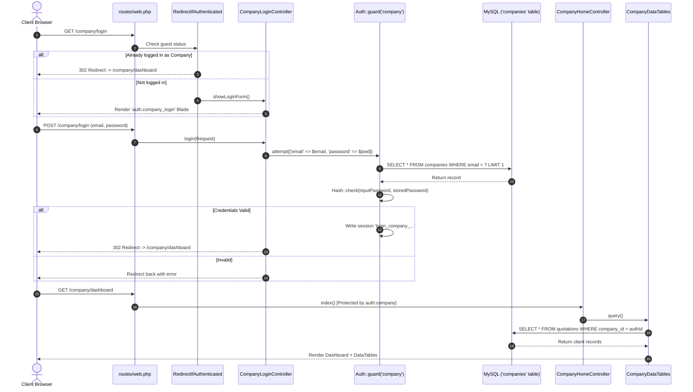
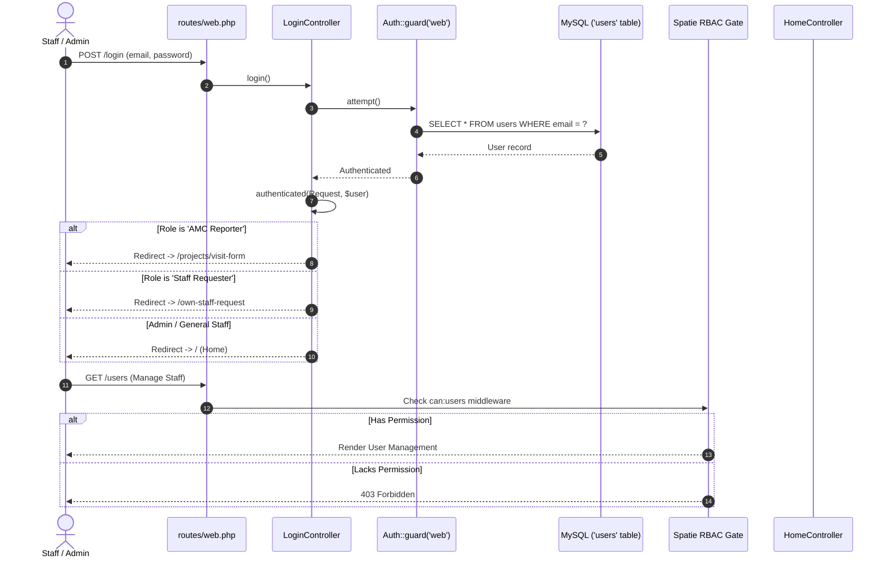
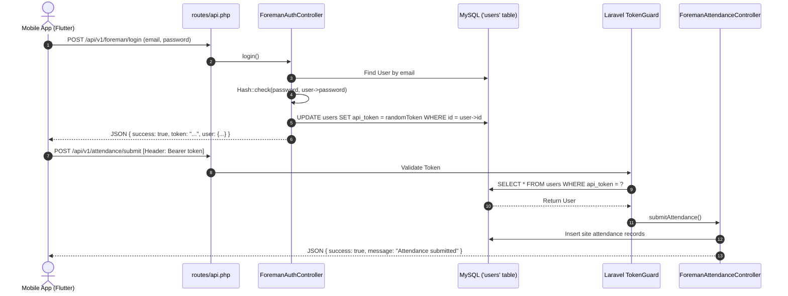

# Comprehensive Code Execution Guide: Multi-Portal Architecture

This guide explains **step-by-step and portal-by-portal** how the code executes in this application, from the moment a user enters a URL to the middleware checks, database queries, and view rendering.

## 🚀 Live Login Portals & Tested Test Accounts

| Portal | Audience / Role | Login URL | Email | Password | Access Level |
| :--- | :--- | :--- | :--- | :--- | :--- |
| **Super Admin** | Executive & IT Admin | [http://127.0.0.1:8001/login](http://127.0.0.1:8001/login) | `admin@example.com` | `password` | `Super-User` (Full system access, settings, finance, roles) |
| **Internal Staff** | Non-Admin Operations | [http://127.0.0.1:8001/login](http://127.0.0.1:8001/login) | `staff@example.com` | `password` | `Staff` (Quotations, projects, clients, tasks, tickets) |
| **Regular User** | Employee Self-Service | [http://127.0.0.1:8001/login](http://127.0.0.1:8001/login) | `user@user.com` | `password` | `Staff` (Restricted operational features) |
| **Client Portal** | External Client Company | [http://127.0.0.1:8001/company/login](http://127.0.0.1:8001/company/login) | `client@example.com` | `password` | **Al Futtaim Engineering** (Quotations, invoices, LPOin) |

---

## 📑 Table of Contents
1. [Architectural Overview & Multi-Auth Core](#1-architectural-overview--multi-auth-core)
2. [Portal 1: Client Company Portal (`company` Guard)](#2-portal-1-client-company-portal-company-guard)
3. [Portal 2: Internal Admin & Staff Portal (`web` Guard)](#3-portal-2-internal-admin--staff-portal-web-guard)
4. [Portal 3: Field Operations & Mobile API (`api` Guard)](#4-portal-3-field-operations--mobile-api-api-guard)
5. [Model & Database Schema Properties](#5-model--database-schema-properties)
6. [Cross-Portal Security & Isolation Matrix](#6-cross-portal-security--isolation-matrix)

---

## 1. Architectural Overview & Multi-Auth Core

Laravel uses **Authentication Guards** to define how users are authenticated per request and which database table provides the user data.

### Configuration (`config/auth.php`)
```php
'defaults' => [
    'guard' => 'web',       // Default guard for standard routes
    'passwords' => 'users',
],

'guards' => [
    'web' => [
        'driver' => 'session',
        'provider' => 'users',
    ],
    'company' => [
        'driver' => 'session',
        'provider' => 'companies',
    ],
    'api' => [
        'driver' => 'token',
        'provider' => 'users',
        'hash' => false,
    ],
],

'providers' => [
    'users' => [
        'driver' => 'eloquent',
        'model' => App\User::class,              // 'users' table
    ],
    'companies' => [
        'driver' => 'eloquent',
        'model' => App\Models\Company::class,     // 'companies' table
    ],
],
```

### Why Multi-Auth?
- **Session Key Separation**: Laravel stores session authentication identifiers separately:
  - `web` guard stores: `login_web_<sha1_hash>`
  - `company` guard stores: `login_company_<sha1_hash>`
- **Independent Logins**: An employee and a client company can be logged in simultaneously in the same browser without their sessions overwriting each other.
- **Model Isolation**: Internal users have roles and permissions via Spatie. Client companies do not have internal roles; their access is strictly scoped to their own `company_id`.

---

## 2. Portal 1: Client Company Portal (`company` Guard)

Dedicated to external client companies to view quotations, purchase orders (LPOin), invoices, and company profiles.



### Detailed Step-by-Step Code Walkthrough:

#### Step 1: Visiting the Login Page (`GET /company/login`)
1. **Route**: Defined in `routes/web.php`:
   ```php
   Route::prefix('company')->group(function() {
       Route::get('/login', 'Auth\CompanyLoginController@showLoginForm')->name('company.login');
   });
   ```
2. **Middleware Execution**: `CompanyLoginController` constructor sets:
   ```php
   $this->middleware('guest')->except('logout');
   ```
   Laravel executes `App\Http\Middleware\RedirectIfAuthenticated`:
   ```php
   if (Auth::guard('company')->check()) {
       return redirect()->route('company.dashboard');
   }
   ```
   If already authenticated, the client is redirected to the dashboard immediately.
3. **Controller Method**: If unauthenticated, `showLoginForm()` runs:
   ```php
   public function showLoginForm() {
       return view('auth.company_login');
   }
   ```

#### Step 2: Submitting the Login Form (`POST /company/login`)
1. **Controller Execution**: Handled by `CompanyLoginController@login`:
   ```php
   public function login(Request $request)
   {
       $this->validate($request, [
           'email' => 'required|email',
           'password' => 'required|min:6',
       ]);

       if (Auth::guard('company')->attempt(
           ['email' => $request->email, 'password' => $request->password],
           $request->remember
       )) {
           return redirect()->intended(route('company.dashboard'));
       }

       return redirect()->back()->withInput($request->only('email', 'remember'))->withErrors([
           'email' => 'These credentials do not match our records.',
       ]);
   }
   ```
2. **How Laravel Verifies the Password**:
   - Matches provider `'companies'` $\rightarrow$ Model: `App\Models\Company`.
   - Executes query: `SELECT * FROM companies WHERE email = ? LIMIT 1`.
   - Evaluates: `Hash::check($request->password, $company->password)`.
   - On success: Stores the session key `login_company_<hash> = $company->id`.

#### Step 3: Accessing Protected Dashboard (`GET /company/dashboard`)
1. **Route Protection**:
   ```php
   Route::prefix('company')->middleware('auth:company')->group(function() {
       Route::get('/dashboard', 'CompanyHomeController@index')->name('company.dashboard');
   });
   ```
2. **How `auth:company` Middleware Works**:
   - The alias `'auth'` calls `Illuminate\Auth\Middleware\Authenticate` with parameter `'company'`.
   - Checks `Auth::guard('company')->check()`.
   - If not logged in, throws `AuthenticationException` and redirects to login.
3. **Data Scoping in DataTables (`CompanyHomeController@index`)**:
   ```php
   public function index(CompanyQuotationDataTable $companyQuotationDataTable,
                         CompanyInvoiceDataTable $companyInvoiceDataTable,
                         CompanyLpoinDataTable $companyLpoinDataTable)
   {
       if (request()->get('table') == 'companyLpoinDataTable') {
           return $companyLpoinDataTable->render('company_home', compact('companyLpoinDataTable'));
       }
       if (request()->get('table') == 'companyInvoiceDataTable') {
           return $companyInvoiceDataTable->render('company_home', compact('companyInvoiceDataTable'));
       }
       return $companyQuotationDataTable->render('company_home',
           compact('companyQuotationDataTable','companyInvoiceDataTable','companyLpoinDataTable'));
   }
   ```
4. **Enforcing Strict Tenant Isolation**:
   Inside `app/DataTables/CompanyCards/CompanyInvoiceDataTable.php`:
   ```php
   public function query(Invoice $model) {
       $model = $model->newQuery()->with('quotation', 'invoice_type');
       $model->whereHas('quotation', function($query) {
           $query->whereId(\Auth::guard('company')->user()->id);
       });
       return $model->orderBy('created_at', 'desc')->get();
   }
   ```
   **Security Guarantee**: A company can never view invoices or quotations belonging to any other company.

#### Step 4: Company Profile View & Update
1. **View Profile**: `GET /company/{id}/profile` $\rightarrow$ `CompanyHomeController@user_profile`:
   ```php
   if (\Auth::guard('company')->user()->id != $id) {
       return abort(404); // Blocks unauthorized access if ID is tampered
   }
   $user = \Auth::guard('company')->user();
   return view('companies.profile')->with('user', $user);
   ```
2. **Update Profile**: `PUT /company/{id}/profile` $\rightarrow$ `update_user_profile`:
   - Validates that `$id == \Auth::guard('company')->user()->id`.
   - If a new password was provided: `$input['password'] = Hash::make($request->password);`.
   - Saves changes via `$user->fill($input); $user->save();`.

#### Step 5: Logging Out (`POST /company/logout`)
```php
public function logout() {
    Auth::guard('company')->logout();
    return redirect('/company/login');
}
```
Flushes only the `company` session, leaving any `web` staff sessions intact.

---

## 3. Portal 2: Internal Admin & Staff Portal (`web` Guard)

Enterprise ERP & CRM portal for internal employees, admins, managers, accountants, and foremen.



### Detailed Step-by-Step Code Walkthrough:

#### Step 1: Employee Login & Dynamic Role Redirection
1. **Controller**: `App\Http\Controllers\Auth\LoginController` uses `AuthenticatesUsers` trait.
2. **Post-Login Routing (`authenticated` hook)**:
   ```php
   protected function authenticated(Request $request, $user)
   {
       // 1. AMC Inspectors bypass admin home and jump to report submission:
       if ($user->hasRole('AMC Reporter') && !$user->can('projects')) {
           return redirect()->route('projects.showForm');
       }

       // 2. Staff members submitting requests jump directly to their requests list:
       if ($user->hasRole('Staff Requester') && !$user->can('stafprofile')) {
           return redirect()->route('own_requests.index');
       }
   }
   ```
   All other roles fall back to `protected $redirectTo = '/';` (`HomeController@index`).

#### Step 2: Role-Based Access Control (RBAC) via Spatie
Routes enforce granular permissions:
```php
Route::resource('roles', 'RoleController')->middleware(['can:roles']);
Route::resource('users', 'UserController')->middleware(['can:users']);
Route::resource('employees', 'EmployeeController')->middleware(['can:employees']);
Route::resource('staf', 'StafProfileController')->middleware(['can:stafprofile']);
```
- When a user accesses `/roles`, Laravel invokes `can:roles`.
- Spatie queries the `permissions`, `roles`, and `model_has_roles` tables for `App\User`.
- If permission is absent, Laravel aborts with `403 Forbidden`.

#### Step 3: Global Safe-Delete Protection Middleware (`CheckDeletePermission`)
Registered in the `'web'` middleware group in `app/Http/Kernel.php`:
```php
public function handle(Request $request, Closure $next)
{
    if ($request->isMethod('delete')) {
        $user = Auth::user();
        if (!$user || !$user->can('deletes')) {
            Flash::error("You don't have permission to delete this!");
            return redirect()->back();
        }
    }
    return $next($request);
}
```
**How it works**: Any HTTP `DELETE` request (deleting invoices, projects, users, or files) is halted unless the user holds the specific global `deletes` permission.

#### Step 4: Admin Dashboard Metrics Gathering (`HomeController@index`)
```php
public function index()
{
    return view('home', [
        'companies'  => \App\Models\Company::count(),
        'projects'   => \App\Models\Project::count(),
        'quotations' => \App\Models\Quotation::count(),
        'users'      => \App\User::count(),
        'requests'   => \App\Models\InvoiceRequest::whereStatus(0)->count(),
        'invoices'   => \App\Models\Invoice::whereStatus(0)->count(),
        'receipts'   => \App\Models\Receipt::with('transaction_payment_type', 'transactionable.quotation.company')
                         ->where('type', 'Receipt')
                         ->whereNotNull('transactionable_id')
                         ->orderBy('id', 'desc')
                         ->where('status', 0)
                         ->get(),
    ]);
}
```

---

## 4. Portal 3: Field Operations & Mobile API (`api` Guard)

Stateless REST API consumed by mobile applications (Flutter) and Progressive Web Apps (PWA) for site foremen and managers.



### Detailed Step-by-Step Code Walkthrough:

#### Step 1: Foreman Login & Token Issuance (`POST /api/v1/foreman/login`)
In `App\Http\Controllers\API\Auth\ForemanAuthController@login`:
```php
public function login(Request $request)
{
    $request->validate([
        'email' => 'required|email',
        'password' => 'required|string|min:6',
    ]);

    $user = User::where('email', $request->email)->first();

    if (!$user || !Hash::check($request->password, $user->password)) {
        return response()->json(['success' => false, 'message' => 'Invalid credentials'], 401);
    }

    // 1. Generate an 80-character random token
    $token = Str::random(80);

    // 2. Persist to database
    $user->update(['api_token' => $token]);

    // 3. Return JSON payload
    return response()->json([
        'success' => true,
        'token'   => $token,
        'user'    => [
            'id'    => $user->id,
            'name'  => $user->name,
            'email' => $user->email,
            'roles' => $user->getRoleNames(),
        ]
    ], 200);
}
```

#### Step 2: Stateless Token Verification (`middleware('auth:api')`)
Every protected API route requires the header:
```http
Authorization: Bearer <80_character_token>
```
- Laravel's `TokenGuard` extracts the token from the header.
- Executes: `SELECT * FROM users WHERE api_token = ? LIMIT 1`.
- Injects the authenticated user into `$request->user()`.
- If token is missing or invalid, immediately outputs HTTP `401 Unauthorized`.

#### Step 3: Example Field Operation (Daily Labor Attendance)
`POST /api/v1/attendance/submit` $\rightarrow$ `ForemanAttendanceController@submitAttendance`:
1. Inspects `$request->user()->id` to identify the submitting foreman.
2. Validates site ID, laborer IDs, and normal/overtime hours.
3. Creates attendance records marked as `'pending'`.
4. Triggers review notifications to managers.

#### Step 4: Logout & Token Revocation (`POST /api/v1/foreman/logout`)
```php
public function logout(Request $request)
{
    $request->user()->update(['api_token' => null]);
    return response()->json(['success' => true, 'message' => 'Logged out successfully']);
}
```
Setting `api_token` to `null` immediately invalidates any further API requests.

---

## 5. Model & Database Schema Properties

### Model: `App\Models\Company` (Table: `companies`)
Extends `Illuminate\Foundation\Auth\User as Authenticatable`.

| Field | Type | Description |
| :--- | :--- | :--- |
| `id` | `int unsigned` | Primary key |
| `name` | `string` | Company legal title |
| `email` | `string (unique)` | Login username for Company Portal |
| `password` | `string (hashed)` | Bcrypt password hash |
| `contact_person` | `string` | Primary contact name |
| `contact_no` / `contact_no_two` | `string` | Telephone contacts |
| `vat_no` | `string` | Tax registration number |
| `location` | `text` | Physical address |
| `billing_address` / `billing_email` | `text` / `string` | Invoicing information |
| `shipping_address` / `shipping_email` | `text` / `string` | Site delivery address |
| `payment_terms` / `credit_limit` | `string` | Credit period & monetary limit |
| `remember_token` | `string` | Remember-me session token |

### Model: `App\User` (Table: `users`)
Extends `Illuminate\Foundation\Auth\User as Authenticatable`.

| Field | Type | Description |
| :--- | :--- | :--- |
| `id` | `int unsigned` | Primary key |
| `name` | `string` | Staff member full name |
| `email` | `string (unique)` | Official corporate email / login username |
| `password` | `string (hashed)` | Bcrypt password hash |
| `image` | `string` | Avatar photo path |
| `api_token` | `string` | Static Bearer token for `/api/*` requests |
| `staf_profile_id` | `int unsigned` | Link to staff HR profile record |
| `remember_token` | `string` | Remember-me session token |

---

## 6. Cross-Portal Security & Isolation Matrix

| Security Feature | Company Portal (`company`) | Admin Portal (`web`) | Field API Portal (`api`) |
| :--- | :--- | :--- | :--- |
| **Authentication Driver** | `session` | `session` | `token` |
| **Model / Table** | `App\Models\Company` (`companies`) | `App\User` (`users`) | `App\User` (`users`) |
| **Session Key** | `login_company_<hash>` | `login_web_<hash>` | Stateless (Header token) |
| **Login Route** | `POST /company/login` | `POST /login` | `POST /api/v1/foreman/login` |
| **Authorization Type** | Hardcoded Scoping (`whereId(authId)`) | Spatie RBAC (`can`, `role`) | Role verification in API |
| **Unauthenticated Action** | Redirects to `/company/login` | Redirects to `/login` | Returns `401 Unauthorized` JSON |
| **Delete Interception** | Form Requests | Global `CheckDeletePermission` | Controller validation |
