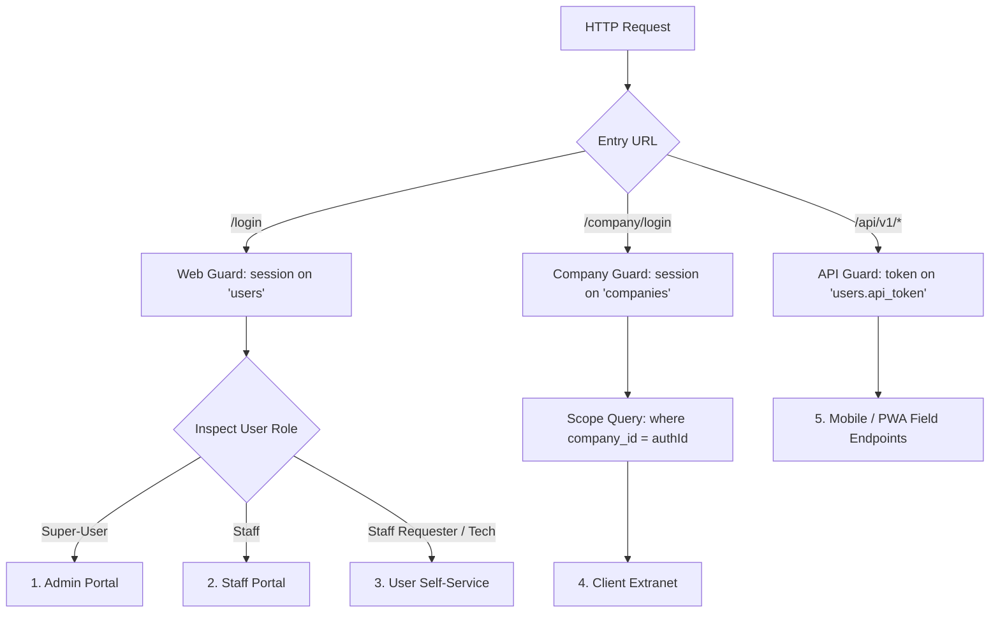

# FTS Portal — Complete Project Documentation & Technical Reference

---

## 1. Executive Summary & System Overview

**FTS Portal (`ft_portal_base`)** is an enterprise-grade ERP, CRM, and operational management platform engineered for Fire Technical Services (FTS). It supports end-to-end contracting operations, low-current engineering (CCTV, Access Control, Fire Alarms), facility maintenance contracts (AMC), multi-tier procurement, double-entry financial ledgers, and field workforce management.

The platform provides a unified system divided across **4 distinct user dimensions**:
1. **Admin Portal**: Executive command, role-based access governance, double-entry accounting ledgers, purchase order approvals, and employee compliance tracking.
2. **Staff Portal**: Day-to-day operations for sales engineers, estimators, and project supervisors (CRM inquiry pipeline, commercial quotations, project tracking, supplier LPOs).
3. **User / Employee Portal**: Employee self-service workspace for field technicians and site personnel (leave requests, salary advances, offline AMC inspection drafts, mobile QR attendance).
4. **Client / Company Portal**: Dedicated customer self-service extranet for client organizations to inspect active quotes, approved tax invoices, accepted purchase orders, and branch profiles.

---

## 2. Technology Stack & Architecture

| Layer | Technology | Details |
| :--- | :--- | :--- |
| **Framework** | Laravel 7.x | PHP MVC Web Application Framework |
| **Runtime** | PHP 7.4 / 8.x | Optimized CLI & FPM execution |
| **Database** | MySQL 5.7+ / MariaDB 10.4+ | Normalized relational schema (`fts_portal`, port 3306) |
| **Admin UI** | AdminLTE 3 / Bootstrap 4 / Blade | Responsive enterprise layout with role-based navigation |
| **Data Tables** | Yajra Laravel DataTables | High-performance server-side paginated, searchable, exportable tables |
| **Access Control** | Spatie Laravel-Permission | Role-Based Access Control (RBAC) with permission gates |
| **Accounting Engine** | CustomBalanceManager & Illuminatech | Real-time double-entry financial transaction ledgers |
| **Media Library** | Spatie Media Library | Polymorphic file attachments, digital signatures, and inspection photos |
| **PDF Generation** | DomPDF & Snappy (wkhtmltopdf) | Automated proposal, tax invoice, and site visit report generation |

---

## 3. Multi-Portal Architecture & Credentials Summary

| Portal | Target Audience | Login URL | Default Email | Password | Access Rights |
| :--- | :--- | :--- | :--- | :--- | :--- |
| **Admin Portal** | Executives, Directors, Head of Accounts | `/login` | `admin@example.com` | `password` | Super-User: Full administrative, financial, approval, and user governance |
| **Staff Portal** | Sales, Estimators, Project Supervisors | `/login` | `staff@example.com` | `password` | Staff: Operational modules (Inquiries, Quotations, Projects, LPOs, Products) |
| **User Portal** | Employees, Technicians, Site Labor | `/login` | `user@user.com` | `password` | Self-Service: My Requests, Leave/Passport workflows, AMC Reports, QR Attendance |
| **Client Portal** | External Customers, Facility Managers | `/company/login` | `client@example.com` | `password` | Client Extranet: Company quotations, billing invoices, and accepted LPO-ins |

---

## 4. Multi-Guard Authentication Lifecycle



### Why Multi-Guard?
* **Session Separation**: Staff session cookies (`login_web_...`) and customer session cookies (`login_company_...`) are saved under different storage keys. Internal employees and client companies can log in on the same device without conflicting.
* **Tenant Scoping**: Client companies authenticate through `App\Models\Company`. Their database queries are hardcoded to filter by `company_id = Auth::guard('company')->user()->id`.

---

## 5. Operational Modules Walkthrough

### 5.1 CRM & Inquiries Pipeline (`/inquiries`)
1. **Inquiry Intake**: Customer inquiries arrive via email, phone, or referral. Recorded with category (`Project`, `AMC`), estimated value, and urgency.
2. **Department Review**: Technical managers review project scope and assign a field engineer for a physical site survey.
3. **Site Survey Report**: Field engineers record site dimensions, required equipment, cable routes, and photos directly into `/inquiries/{id}/engineer/report`.
4. **Sales Conversion**: The commercial team reviews the survey findings, prepares bill of materials, and converts the lead into an active commercial quotation.

### 5.2 Quotation Estimation Engine (`/quotations`)
* Supports two distinct quotation types:
  * **Installation Projects**: Material catalog components, custom line items, profit margins, and installation labor charges.
  * **Annual Maintenance Contracts (AMC)**: Number of preventive maintenance visits per year (e.g. quarterly, monthly), system scopes, and emergency response clauses.
* Generates branded commercial proposals exported as PDF for client delivery.

### 5.3 Project Execution & Shop Drawings (`/projects`)
* Accepted quotations with client purchase orders (LPOin) are converted to active projects.
* Links engineering shop drawings (`/drawing-receiveds`) to track structural blueprint revisions, consultant submissions, and approvals.

### 5.4 AMC Site Visit Reports & Offline Drafts (`/projects/visit-form`)
* Field technicians inspect customer installations (CCTV, fire alarms, access control).
* **Draft Support (`/projects/amc-drafts`)**: Technicians working in basement facilities or offline environments can save inspection records as private drafts.
* **Digital Client Signature**: Customers sign directly on the technician's touchscreen before submission.
* Submitting the report triggers automated PDF dispatch to the client's email.

### 5.5 Procurement & Purchase Orders (`/purchase-orders`, `/lpoouts`)
* Raises material purchase orders against active projects.
* Vendor directory (`/vendors`) tracks credit terms, bank details, and payment preferences.
* LPO revision workflow allows updating supplier pricing without losing document audit trails.

### 5.6 Financial Ledgers & Payment Bookings (`/payment-bookings`)
* Formal tax invoices (`/invoices`) generated with automated email dispatch.
* **Payment Bookings Two-Level Review**: Cheque and cash payments pass through a sequential review:
  * *Level 1*: Verification review by accounts (`verify_payment_bookings`).
  * *Level 2*: Executive approval by management (`approve_payment_bookings`).

### 5.7 HR Compliance & Field Labor Attendance
* **Compliance Alerts**: Real-time tracking of employee visa, passport, and Emirates ID expiration dates.
* **Employee Self-Service (`/own-staff-request`)**: Online request desk for leaves, passport releases, and salary loans.
* **Field QR Attendance (`/api/v1/attendance`)**: Mobile QR check-in verified against office/site GPS geofence coordinates.

---

## 6. Defensive Coding: Preventing DataTables AJAX Crashes

Every major data list uses **Yajra DataTables** for server-side processing. To prevent unhandled exceptions from triggering the dreaded `DataTables warning: Ajax error tn/7`, all relationship access is protected by **defensive null checks**:

```php
// ProjectDataTable.php implementation:
->addColumn('quotation_link', function ($query) {
    if (!$query->quotation) return '-';
    return view('components.datatables_relation_link', [
        'id' => $query->quotation->id,
        'name' => $query->quotation->name,
        'model' => 'quotations'
    ]);
})
->addColumn('company_link', function ($query) {
    if (!$query->quotation || !$query->quotation->company) return '-';
    return view('components.datatables_relation_link', [
        'id' => $query->quotation->company->id,
        'name' => $query->quotation->company->name,
        'model' => 'companies'
    ]);
})
```

---

## 7. Useful Maintenance Commands

```powershell
# Start local server on port 8001
php artisan serve --port=8001

# Re-link storage directory for uploaded files
php artisan storage:link

# Clear all cached configurations and views
php artisan config:clear
php artisan route:clear
php artisan view:clear

# Seed verified test accounts
php artisan db:seed
```
